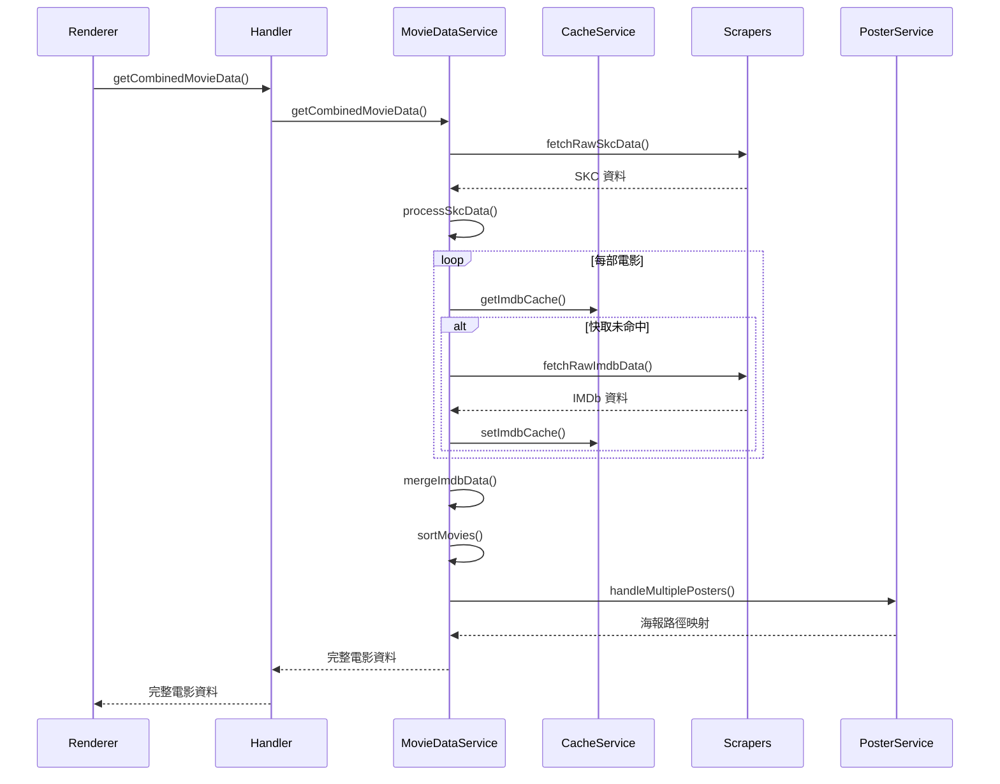

# 架構說明文檔

## 概述

本專案採用模組化架構設計,將複雜的業務邏輯拆分為清晰的層次結構,提高代碼可維護性和可測試性。

## 架構原則

### 1. 關注點分離 (Separation of Concerns)

每個模組只負責單一職責:
- **服務層**: 處理業務邏輯
- **處理器層**: 處理 IPC 通信
- **爬蟲層**: 處理資料獲取
- **工具層**: 提供通用功能

### 2. 依賴注入 (Dependency Injection)

服務之間透過單例模式和明確的介面進行通信,降低耦合度。

### 3. 類型安全 (Type Safety)

使用 TypeScript 嚴格類型檢查,統一類型定義在 `shared/types/` 目錄。

## 主進程架構

### 層次結構

```
┌─────────────────────────────────────┐
│         main/index.ts               │  應用初始化、視窗管理
│      (90 行,簡化入口)                │
└──────────────┬──────────────────────┘
               │
    ┌──────────┼──────────┐
    │          │          │
    v          v          v
┌────────┐ ┌────────┐ ┌──────────┐
│Handlers│ │Protocol│ │ Services │    中間層
└────┬───┘ └───┬────┘ └─────┬────┘
     │         │            │
     └─────────┼────────────┘
               │
               v
         ┌──────────┐
         │ Scrapers │              資料層
         └──────────┘
```

### 模組說明

#### 1. 服務層 (Services)

**cache.service.ts**
- 統一管理所有快取操作
- 提供海報、IMDb、SKC 資料的 CRUD 方法
- 自動處理快取過期邏輯

**poster.service.ts**
- 處理海報下載
- 管理本地快取目錄
- 批量處理海報請求

**movie-data.service.ts**
- 協調 SKC 和 IMDb 資料獲取
- 管理資料合併和排序
- 發送進度更新到渲染進程

#### 2. 處理器層 (Handlers)

**movie.handler.ts**
- 處理電影相關的 IPC 請求
- 委派具體邏輯到服務層

**external.handler.ts**
- 處理外部連結開啟請求
- 安全性驗證

**index.ts**
- 統一註冊所有 IPC 處理器

#### 3. 協議層 (Protocols)

**app-protocol.ts**
- 註冊 `app://` 自定義協議
- 處理本地資源請求
- 安全性檢查 (防止目錄遍歷)

#### 4. 爬蟲層 (Scrapers)

**imdb.scraper.ts**
- 使用 axios + cheerio 爬取 IMDb
- 解析 JSON-LD 和 HTML
- 智能搜尋和匹配

**skc.scraper.ts**
- 呼叫 SK Cinema API
- 生成安全性 token
- 處理場次資料

## 渲染進程架構

### 組件層次

```
App.vue (主容器)
├── AppHeader.vue (頂部標題列)
├── MovieListSidebar.vue (電影列表側邊欄)
│   └── (電影卡片)
└── MovieDetailsPanel.vue (電影詳情面板)
    ├── (電影資訊)
    └── (場次列表)
```

### 工具模組

**formatters.ts**
- 格式化顯示文字

**date-utils.ts**
- 日期處理邏輯

**session-utils.ts**
- 場次分組和排序

## 共享模組

### 類型定義 (shared/types/)

**movie.types.ts**
```typescript
- CombinedMovieData: 完整電影資料結構
- ImdbRawDataPayload: IMDb 原始資料
- FetchImdbStatus: IMDb 抓取狀態
```

**session.types.ts**
```typescript
- SKCSession: 場次資訊結構
- SkcRawDataPayload: SKC 原始資料
```

**ipc.types.ts**
```typescript
- IpcChannels: IPC 頻道名稱
- 所有 Handler 和 Renderer 類型
- LoadingProgressPayload: 進度更新結構
```

### 常數管理 (shared/constants/)

統一管理專案中的常數:
- 快取過期時間
- API 超時設定
- 視窗配置
- 特殊評分值

## 資料流程

### 獲取電影資料流程



### 快取策略

#### 海報快取
- **位置**: `userData/imageCache/`
- **格式**: `{filmNameID}.{ext}`
- **過期**: 7 天
- **檢查**: 每次請求時驗證文件存在性

#### IMDb 快取
- **位置**: electron-store
- **鍵**: `imdbCache.{filmNameID}`
- **結構**: `{ timestamp, data }`
- **過期**: 24 小時

#### SKC 快取  
- **位置**: electron-store
- **鍵**: `skcRawDataCache`
- **結構**: `{ fetchTimestamp, data }`
- **過期**: 隔天凌晨 00:00

## 錯誤處理

### 分層錯誤處理

1. **爬蟲層**: 返回詳細的狀態碼和錯誤訊息
2. **服務層**: try-catch 包裝,記錄日誌
3. **處理器層**: 捕獲服務層錯誤,返回友好訊息
4. **渲染層**: 顯示錯誤提示給用戶

### 錯誤類型

- `fetch-failed`: 網路請求失敗
- `not-found`: 資源未找到
- `no-rating`: IMDb 無評分
- `parse-error`: 資料解析錯誤

## 效能優化

### 1. 並行請求

IMDb 資料查詢使用 `Promise.allSettled()` 並行處理,顯著提升速度。

### 2. 智能快取

三層快取策略減少不必要的網路請求:
- 海報快取避免重複下載大文件
- IMDb 快取降低 API 請求頻率
- SKC 快取減輕伺服器壓力

### 3. 漸進式載入

透過 IPC 發送進度更新,提供即時反饋:
```typescript
type LoadingProgressType = 
  | 'initializing'
  | 'fetching-skc'
  | 'processing-skc'
  | 'starting-imdb'
  | 'imdb-progress-success'
  | ...
```

## 安全性

### 1. 輸入驗證

- URL 白名單驗證 (只允許 SKC 和 IMDb 域名)
- 文件路徑清理 (防止目錄遍歷)

### 2. Content Security Policy

使用 Electron 的安全最佳實踐:
- `sandbox: false` 僅在需要時使用
- Context Isolation 啟用
- Node Integration 禁用 (渲染進程)

### 3. 自定義協議

`app://` 協議只能訪問指定的 imageCache 目錄,防止任意文件讀取。

## 可測試性

### 單例模式

所有服務都導出單例,方便測試時 mock:

```typescript
export class CacheService { ... }
export const cacheService = new CacheService();
```

### 依賴注入

服務之間通過 import 單例,而非直接實例化,便於替換。

### 純函數

工具函數設計為純函數,易於單元測試。

## 擴展性

### 添加新的資料源

1. 在 `scrapers/` 創建新的爬蟲
2. 在服務層整合
3. 更新類型定義
4. 註冊 IPC 處理器

### 添加新功能

1. 在對應層次添加實現
2. 更新 IPC 介面 (如需要)
3. 更新渲染進程 UI

## 設計決策記錄

### 為什麼使用 Cheerio 而非 Playwright?

- **輕量**: Cheerio 不需要下載瀏覽器二進制檔
- **快速**: 純 DOM 解析比瀏覽器渲染快得多
- **穩定**: IMDb 頁面結構相對穩定,不需要 JavaScript 渲染

### 為什麼不使用 Vuex/Pinia?

- 應用狀態簡單,不需要複雜的狀態管理
- 所有資料都是從 IPC 獲取,無需在前端持久化
- Vue 3 Composition API 已足夠處理組件狀態

### 為什麼使用單例模式?

- Electron 主進程只有一個實例
- 服務需要共享狀態 (如快取)
- 簡化依賴管理

## 維護指南

### 代碼規範

- 使用 ESLint + Prettier
- TypeScript 嚴格模式
- 統一的命名規範 (camelCase, PascalCase)

### 日誌規範

```typescript
console.log('[ModuleName] Description:', data);
console.error('[ModuleName] Error:', error);
```

### 文件組織

- 一個文件一個主要類/函數
- 相關功能分組到目錄
- index.ts 作為對外介面

## 未來改進

1. **測試覆蓋**: 添加單元測試和整合測試
2. **錯誤恢復**: 更完善的錯誤恢復機制
3. **離線模式**: 完全依賴快取工作
4. **多語言支援**: i18n 國際化
5. **效能監控**: 添加效能追蹤和分析
